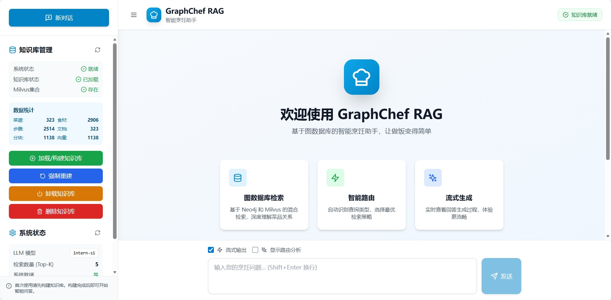

# GraphChef RAG - 基于图数据库的智能烹饪问答系统

> 一个融合知识图谱、向量检索和大语言模型的新一代 RAG 系统

## 项目简介

本项目在Datawhale社区all-in-rag项目提供的图RAG实践基础上添加前后端系统，优化RAG方案而来。GraphChef RAG 是一个基于图数据库的智能检索增强生成（RAG）系统，专注于烹饪领域的知识问答。项目创新性地将传统 RAG 与图数据库技术深度融合，实现了从简单文档检索到复杂关系推理的智能升级。

## 项目完整演示截图




## 核心特性

### 后端架构亮点

1. **双模检索引擎**
   - 传统混合检索：向量相似度 + BM25 关键词匹配，使用 RRF（Reciprocal Rank Fusion）重排
   - 图 RAG 检索：基于 Neo4j 的多跳图遍历和知识子图提取

2. **智能查询路由**
   - 基于 LLM 的查询意图理解
   - 自动识别查询复杂度和关系密集度
   - 动态选择最优检索策略（传统检索/图 RAG/组合策略）

3. **双层检索范式**
   - 实体级检索：精确匹配具体食材、菜品
   - 主题级检索：理解抽象概念、烹饪风格
   - 图索引键值对结构，支持高效检索

4. **多跳图推理**
   - 支持 1-3 跳的图遍历深度
   - 路径相关性评分算法
   - 知识子图提取与推理链构建

5. **流式生成**
   - SSE（Server-Sent Events）实时流式输出
   - 带重试机制的鲁棒性设计
   - 后备非流式生成保障

## 技术栈

### 后端核心技术

| 技术栈 | 版本 | 用途 |
|--------|------|------|
| **Python** | 3.10+ | 主要开发语言 |
| **FastAPI** | Latest | 异步 Web 框架，RESTful API |
| **Neo4j** | 5.x | 图数据库，存储菜谱知识图谱 |
| **Milvus** | 2.5.x | 向量数据库，语义相似度检索 |
| **LangChain** | 0.3.x | RAG 框架，检索和生成链路 |
| **HuggingFace Transformers** | 4.40+ | 深度学习模型库 |
| **sentence-transformers** | 3.0+ | 文本嵌入模型 |
| **BGE-small-zh-v1.5** | - | 中文向量化模型（512维） |
| **OpenAI API** | - | 大语言模型接口（InternLM） |

### 前端技术

- React 18 + TypeScript
- Vite 构建工具
- Tailwind CSS 样式框架
- React Markdown 渲染

## 系统架构

### 整体架构图

```
┌─────────────────────────────────────────────────────────────┐
│                         前端层                               │
│            React + TypeScript + Tailwind CSS                │
└──────────────────────┬──────────────────────────────────────┘
                       │ HTTP/SSE
┌──────────────────────▼──────────────────────────────────────┐
│                      API 层                                  │
│                   FastAPI 异步服务                           │
│  ┌─────────────────────────────────────────────────────┐    │
│  │  /api/ask              - 标准问答                    │    │
│  │  /api/ask/stream       - 流式问答                    │    │
│  │  /api/knowledge-base/* - 知识库管理                  │    │
│  │  /api/system/*         - 系统状态管理                │    │
│  └─────────────────────────────────────────────────────┘    │
└──────────────────────┬──────────────────────────────────────┘
                       │
┌──────────────────────▼──────────────────────────────────────┐
│                   智能查询路由层                             │
│              IntelligentQueryRouter                         │
│  ┌──────────────────┐         ┌──────────────────┐         │
│  │  查询意图理解     │         │  复杂度分析       │         │
│  └──────────────────┘         └──────────────────┘         │
│           │                              │                  │
│           ▼                              ▼                  │
│  ┌─────────────────┐          ┌──────────────────┐         │
│  │ 传统混合检索     │          │   图 RAG 检索     │         │
│  └─────────────────┘          └──────────────────┘         │
└──────────────────────┬──────────────────┬──────────────────┘
                       │                  │
        ┌──────────────▼──────┐   ┌──────▼─────────────┐
        │  混合检索引擎        │   │   图检索引擎        │
        │  ┌──────────────┐   │   │  ┌──────────────┐  │
        │  │ 双层检索      │   │   │  │ 多跳遍历      │  │
        │  │ - 实体级      │   │   │  │ 知识子图      │  │
        │  │ - 主题级      │   │   │  │ 图推理        │  │
        │  └──────────────┘   │   │  └──────────────┘  │
        │  ┌──────────────┐   │   │                    │
        │  │ 向量检索      │   │   │                    │
        │  └──────────────┘   │   │                    │
        │  ┌──────────────┐   │   │                    │
        │  │ BM25检索      │   │   │                    │
        │  └──────────────┘   │   │                    │
        └──────────┬───────────┘   └──────────┬─────────┘
                   │                          │
        ┌──────────▼──────────────────────────▼─────────┐
        │              数据存储层                        │
        │  ┌──────────────┐      ┌──────────────┐      │
        │  │   Milvus     │      │    Neo4j     │      │
        │  │  向量数据库   │      │   图数据库    │      │
        │  └──────────────┘      └──────────────┘      │
        └────────────────────────────────────────────────┘
                   │
        ┌──────────▼──────────────────────────┐
        │         生成层                       │
        │  ┌────────────────────────┐         │
        │  │ GenerationModule       │         │
        │  │ - 自适应提示词          │         │
        │  │ - 流式/非流式生成       │         │
        │  │ - 错误重试机制          │         │
        │  └────────────────────────┘         │
        └──────────────────────────────────────┘
```

### 核心模块说明

#### 1. GraphDataPreparationModule（图数据准备）

**职责：** 从 Neo4j 加载图数据并转换为 RAG 可用的文档格式

**关键功能：**
- 连接 Neo4j 图数据库，加载菜谱、食材、烹饪步骤节点
- 构建完整菜谱文档，集成食材和步骤关系
- 文档分块处理（按章节智能分割）
- 统计分析（分类、难度、菜系分布）

**技术实现：**
```python
# 示例：图遍历获取菜谱相关信息
MATCH (r:Recipe {nodeId: $recipe_id})-[req:REQUIRES]->(i:Ingredient)
RETURN i.name, req.amount, req.unit
```

#### 2. MilvusIndexConstructionModule（向量索引构建）

**职责：** 构建和管理 Milvus 向量索引

**关键功能：**
- 使用 BGE-small-zh-v1.5 模型生成 512 维向量
- 创建 Milvus 集合，配置 COSINE 相似度
- 使用 HNSW 索引算法（M=16, efConstruction=200）
- 支持增量更新和持久化

**Schema 设计：**
- vector (FLOAT_VECTOR, 512维)
- text (VARCHAR, 15000)
- 元数据字段：node_id, recipe_name, category, cuisine_type, difficulty 等

#### 3. HybridRetrievalModule（混合检索）

**职责：** 实现双层检索范式和多路召回

**关键技术：**

**3.1 双层检索**
- **实体级检索：** 精确匹配具体食材、菜品名称
  - 使用图索引键值对结构
  - 一跳邻居扩展增强上下文

- **主题级检索：** 理解抽象概念（如"川菜"、"低热量"）
  - 关系键值对索引
  - LLM 增强的主题关键词提取

**3.2 Round-robin 合并策略**
```python
# 公平轮询合并不同检索源
for i in range(max_len):
    if i < len(dual_docs):
        merged_docs.append(dual_docs[i])
    if i < len(vector_docs):
        merged_docs.append(vector_docs[i])
```

#### 4. GraphRAGRetrieval（图 RAG 检索）

**职责：** 基于图结构的深度推理和检索

**核心能力：**

**4.1 查询意图理解**
```python
QueryType:
    - ENTITY_RELATION: 实体间直接关系
    - MULTI_HOP: 多跳推理
    - SUBGRAPH: 子图查询
    - PATH_FINDING: 路径查找
    - CLUSTERING: 聚类相似性
```

**4.2 多跳图遍历**
- 1-3 跳可配置深度
- 路径相关性评分：`(1.0/path_len) + node_degree_score + relation_match_score`
- 动态查询规划

**4.3 知识子图提取**
```python
# Neo4j Cypher 示例
MATCH (source)-[r*1..{max_depth}]-(neighbor)
WITH source, collect(DISTINCT neighbor) as neighbors
RETURN nodes, relationships, graph_metrics
```

#### 5. IntelligentQueryRouter（智能路由）

**职责：** 根据查询特征选择最优检索策略

**决策维度：**
- **查询复杂度**（0-1）：简单信息查找 vs 复杂推理
- **关系密集度**（0-1）：单一实体 vs 复杂关系网络
- **推理需求**：是否需要多跳推理、因果分析

**路由策略：**
```python
if complexity < 0.4 and relation_intensity < 0.4:
    strategy = HYBRID_TRADITIONAL  # 传统检索
elif complexity >= 0.7 or relation_intensity >= 0.7:
    strategy = GRAPH_RAG  # 图 RAG
else:
    strategy = COMBINED  # 组合策略
```

#### 6. GenerationIntegrationModule（生成集成）

**职责：** LLM 集成和答案生成

**关键特性：**
- 自适应提示词（根据检索层级调整）
- 流式生成（SSE）+ 重试机制（最多 3 次）
- 后备非流式生成保障
- 支持 Markdown 格式输出

**流式实现：**
```python
async def generate_stream():
    for chunk in llm.stream(prompt):
        yield f"data: {json.dumps({'chunk': chunk})}\n\n"
    yield f"data: {json.dumps({'done': True})}\n\n"
```


## API 接口设计

### 核心接口

| 端点 | 方法 | 说明 |
|------|------|------|
| `/api/health` | GET | 健康检查 |
| `/api/ask` | POST | 标准问答（非流式） |
| `/api/ask/stream` | POST | 流式问答（SSE） |
| `/api/knowledge-base/status` | GET | 获取知识库状态 |
| `/api/knowledge-base/build` | POST | 构建/加载知识库 |
| `/api/knowledge-base/unload` | POST | 卸载知识库 |
| `/api/knowledge-base` | DELETE | 删除知识库 |
| `/api/system/status` | GET | 获取系统状态 |
| `/api/system/reload` | POST | 重新加载系统 |


## 技术亮点总结

### 创新点

1. **图 RAG 与传统 RAG 的智能融合**
   - 不是简单替换，而是根据查询特征动态选择
   - 首创查询路由器自动判断检索策略

2. **双层检索范式**
   - 实体级+主题级双层召回
   - 解决了传统 RAG 难以理解抽象概念的问题

3. **知识子图推理**
   - 不仅检索文档，还能进行图结构推理
   - 支持多跳关系发现和因果分析

4. **生产级工程实践**
   - 异步架构 + 流式输出
   - 完善的错误处理和重试机制
   - 手动知识库管理，避免启动阻塞

### 技术深度

- **图数据库应用**：Neo4j Cypher 复杂查询、路径算法
- **向量检索**：Milvus HNSW 索引、相似度计算
- **信息检索**：RRF 融合、BM25 算法
- **深度学习**：Sentence Transformers、文本嵌入
- **LLM 集成**：Prompt Engineering、流式生成
- **异步编程**：FastAPI 异步架构、ThreadPoolExecutor

## 环境配置

### 必需服务

1. **Neo4j**
   - 版本：5.x
   - 端口：7687（Bolt）
   - 数据库：neo4j

2. **Milvus**
   - 版本：2.5.x
   - 端口：19530
   - 存储：本地持久化

3. **Python 环境**
   - Python 3.10+
   - CUDA（可选，用于 GPU 加速）

### 安装步骤

```bash
# 1. 安装依赖
cd graph_rag
pip install -r requirements.txt

# 2. 配置环境变量
cp .env.example .env
# 编辑 .env 文件，设置 INTERN_API_KEY

# 3. 启动服务
python main.py
```

### 前端启动（可选）

```bash
cd frontend
npm install
npm run dev
```

## 使用示例

### 1. 构建知识库

```bash
POST http://localhost:8000/api/knowledge-base/build
{
  "force_rebuild": false
}
```

### 2. 查询问答

```bash
POST http://localhost:8000/api/ask/stream
{
  "question": "推荐几个简单的川菜",
  "stream": true,
  "explain": true
}
```

### 3. 查看系统状态

```bash
GET http://localhost:8000/api/system/status
```

## 项目结构

```
graph_rag/
├── api/
│   ├── dependencies.py          # FastAPI 依赖注入
│   └── rag_router.py            # API 路由（异步）
├── rag_modules/
│   ├── graph_data_preparation.py       # 图数据准备
│   ├── milvus_index_construction.py    # Milvus 索引
│   ├── hybrid_retrieval.py             # 混合检索
│   ├── graph_rag_retrieval.py          # 图 RAG 检索
│   ├── intelligent_query_router.py     # 智能路由
│   ├── generation_integration.py       # 生成集成
│   ├── graph_indexing.py               # 图索引键值对
│   └── main_module.py                  # 主系统模块
├── config.py                    # 配置管理
├── main.py                      # FastAPI 入口
└── requirements.txt             # 依赖列表

frontend/
├── src/
│   ├── api/
│   │   └── client.ts           # API 客户端
│   ├── components/             # React 组件
│   ├── types/                  # TypeScript 类型
│   └── App.tsx                 # 主应用
└── package.json                # 前端依赖
```

## 联系方式

- 作者：[霍奕铭]
- 邮箱：[2016668220@qq.com]

## 致谢
感谢Datawhale开源社区提供的教程以及实践

感谢 Neo4j 和 Milvus 提供的优秀数据库产品

感谢 INTERN AI 提供的LLM服务

感谢所有开源社区的贡献者
